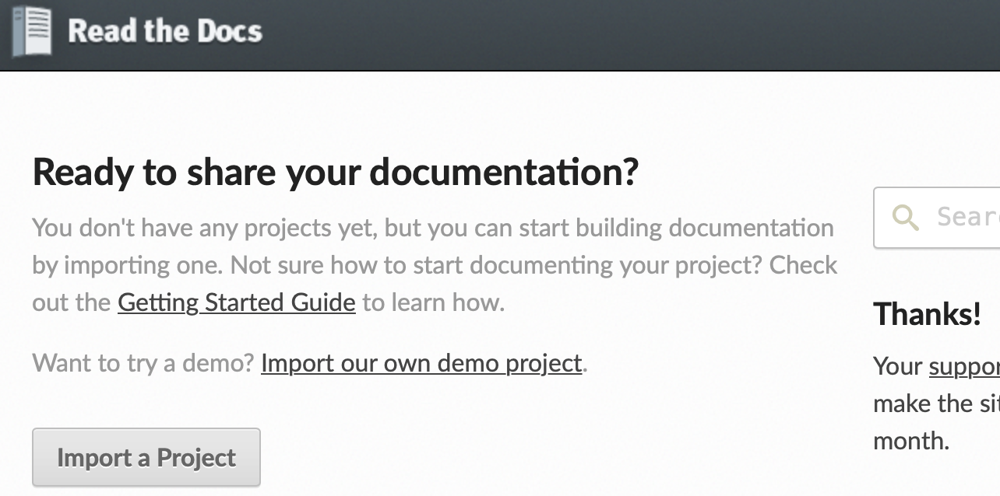

# Create document by Readthedocs

## 1. Sphinx

> Sphinx is a powerful documentation generator that has many great features for writing technical documentation

First, make sure we have installed `Sphinx`

 ```shell
pip install sphinx
pip install sphinx_rtd_theme  #download readthedocs theme
 ```

Second, create the folder:

```
mkdir rinkou
cd rinkou
```

Then, start the sphinx project:

```shell
sphinx-quickstart
```

Type your choose:

```shell
> Separate source and build directories (y/n) [n]: y
> Project name: rinkou20210108
> Author name(s): wangjiankang
> Project release []: 0.0.1
> Project language [en]: en
```

Now, the folder structure should be:

```
rinkou
├── Makefile
├── build
├── make.bat
└── source
    ├── _static
    ├── _templates
    ├── conf.py
    └── index.rst
```

## 2. Write some test file

> **reStructuredText** (**RST**, **ReST**, or **reST**) is a file format for textual data used primarily in the Python programming language community for technical documentation

> reStructuredText (.rst) is the preferred format for technical documentation than markdown(.md), see [Why You Shouldn’t Use “Markdown” for Documentation](https://www.ericholscher.com/blog/2016/mar/15/dont-use-markdown-for-technical-docs/)

For example:

```rst
Section Header
==============

Subsection Header
-----------------
```

Now we create `hello.rst` in `source` folder:

```
hello,world
=============
test the rst
```

and modify `index.rst` to:

```rst
.. toctree::
   :maxdepth: 2
   :caption: Contents:

   hello   #Name of your rst file
```

Then, back to the `rinkou` folder, run:

```shell
make html
```

Open, the file `rinkou/build/html/index.html` with your web browser, you can see:


## 3. Use the RTD(ReadTheDocs) theme

Find `source/conf.py` and modify the line `html_theme = 'alabaster'` to

```python
import sphinx_rtd_theme
html_theme = "sphinx_rtd_theme"
```

Back to the `rinkou` folder and re-run:

```shell
make html
```

Now open the `index.html` again, the page should be:


## 4. Use Markdown (instead of rst) with sphinx

- Some people still prefer the markdown style.
- A package `recommonmark` let us directly use markdown in sphinx.

Step1, install it:

```python
pip install recommonmark
```

Step2, modify the `rinkou/source/conf.py` :

```python
# for Sphinx-1.4 or newer
extensions = ['recommonmark']

# for Sphinx-1.3
from recommonmark.parser import CommonMarkParser

source_parsers = {
    '.md': CommonMarkParser,
}

source_suffix = ['.rst', '.md']
```

By these two step, now we can directly use markdown file. For example, create a markdown file `testMarkdown.md` in `rinkou/source/`, and write: 

```
# Hello, markdown

## something
```

Then, modify `index.rst` to:

```python
.. toctree::
   :maxdepth: 2
   :caption: Contents:

   hello
   testMarkdown
```

Now, back to `rinkou` folder, re-run `make html` and open `index.html`:


## 5. Publish to ReadTheDocs

### 5.1 Push our project to GitHub.

First, create a new repository on GitHub and copy the link (https://github.com/wangjk321/rinkou2021.git)

<div style="padding: 15px; border: 1px solid transparent; border-color: transparent; margin-bottom: 20px; border-radius: 4px; color: #8a6d3b;; background-color: #fcf8e3; border-color: #faebcc;">
The repository must be public (not private)
</div>

Then, in the `rinkou` folder of your local PC, create a `.gitignore` file and write:

```
build/
```

because we don't need to push the `build` folder.

Now, run:

```shell
git init
git remote -v
git remote add origin https://github.com/wangjk321/rinkou2021.git
git add .
git commit -m "push_to_github"
git push -u origin master
```

The project is already on GitHub.

### 5.2 Link to ReadTheDocs

- Register account on https://readthedocs.org

- Login and linking your GitHub account to your ReadTheDocs account

- Click 'Import a Project'

  

- Choose the `rinkou2021` repository
- Click "Next" --> "Build version"-->"View Docs"
- Now the document is online https://rinkou2021.readthedocs.io/en/latest/

