# RNA-seq Splicing analysis (Rinkou20210319-Wang)

## 1. Concept of Alternative Splicing

- Alternative splicing is a process that enables a **messenger RNA (mRNA) to direct synthesis of different protein variants (isoforms)** that may have different cellular functions or properties. 
- It occurs by **rearranging the pattern of intron and exon** elements that are joined by splicing to alter the mRNA coding sequence.


- Main types of splicing:

  

  Or in a more detailed classification:

  


## 2. SGSeq

*SGSeq* provides a framework for analyzing splice events from RNA-seq data.

-*R/Bioconductor* package

### 2.1 Overview

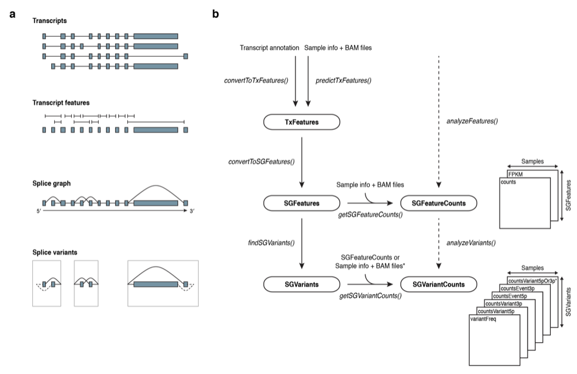

- The ***TxFeatures*** class stores discrete transcript features (exons and splice junctions) as they are observed in RNA transcripts.
  - From genome annotation file (.gff)
  - OR, de novo prediction from samples
- The ***SGFeatures*** class stores features defining a **splice graph** (Heber et al. 2002). The splice graph is a directed acyclic (有向非巡回) graph (directed from the 5′′ end to the 3′′ end of a gene)
  - **edges** corresponding to exonic regions and splice junctions, 
  - **nodes** corresponding to transcript starts, ends and splice sites.
- The ***SGVariants*** class stores splice variants.
  - **Splice variants** sharing the same start and end node, together form a **splice event**.


- => One **gene** could have many **splice events**
  - one splice events is consist of many (>=2) **splice variants**


### 2.2 Preparation of Input bam files

- Installation

```R
BiocManager::install("SGSeq")
library(SGSeq)
```

- Requirements for the Bam file:

  > For *SGSeq* to work correctly it is essential that reads were mapped with a splice-aware alignment program, such as GSNAP (T. D. Wu and Nacu 2010), HISAT (Kim, Langmead, and Salzberg 2015) or STAR (Dobin et al. 2013), which generate SAM/BAM files with custom tag ‘XS’ for spliced reads, indicating the direction of transcription.

  ```
  $samtools view Rad21KD_rep1.bam |grep XS |head
  
  HWI-D00229:285:CE888ANXX:1:2306:9926:89592	272	chr16	12360	0	19M705N47M	*0	0	CGACTTGGATCACACTCTTAGCCTCCACCACCCCGAGATCACATTTCTCACTGCCTTTTGTCTGCC	GGGGGGGGGGGGGGGGGGGGGGGGGGGGGGGGGGGGGGGGGGGGGGGGGGGGGGGGGGGGGCCCCC	NH:i:5	HI:i:5	AS:i:64	nM:i:0	NM:i:0	MD:Z:66	jM:B:c,1	jI:B:i,12379,13083	XS:A:+
  HWI-D00229:285:CE888ANXX:3:1109:4408:30160	256	chr16	14482	0	30M140N36M	*0	0	CACCAGCCCCAGGTCCTTTCCCAGAGATGCCCTTGCGCCTCATGACCAGCTTGTTGAAGAGATCCG	A3AA0;>>/F</0;EG11EG1E@GB0EC1111E>1E/>F/<F11B:1:E@GGBBC:1:FGG11110	NH:i:6	HI:i:3	AS:i:66	nM:i:0	NM:i:0	MD:Z:66	jM:B:c,22	jI:B:i,14512,14651	XS:A:-
  ```

- Input file.

  Sample information can be stored in a *data.frame* or *DataFrame* object:

  | sample_name | file_bam         | paired_end | read_length | frag_length | lib_size |
  | :---------- | :--------------- | :--------- | :---------- | :---------- | :------- |
  | N1          | /xxx/bams/N1.bam | TRUE       | 75          | 293         | 12405197 |
  | N2          | /xxx/bams/N2.bam | TRUE       | 75          | 197         | 13090179 |
  | N3          | /xxx/bams/N3.bam | TRUE       | 75          | 206         | 14983084 |
  | N4          | /xxx/bams/N4.bam | TRUE       | 75          | 207         | 15794088 |
  | T1          | /xxx/bams/T1.bam | TRUE       | 75          | 284         | 14345976 |
  | T2          | /xxx/bams/T2.bam | TRUE       | 75          | 235         | 15464168 |
  | T3          | /xxx/bams/T3.bam | TRUE       | 75          | 259         | 15485954 |
  | T4          | /xxx/bams/T4.bam | TRUE       | 75          | 247         | 15808356 |

  - *sample_name* Character vector with a unique name for each sample

  - *file_bam* Character vector or *BamFileList* specifying BAM files generated with a splice-aware alignment program

  - *paired_end* Logical vector indicating whether data are paired-end or single-end

  - *read_length* Numeric vector with read lengths

  - *frag_length* Numeric vector with average fragment lengths (for paired-end data)

  - *lib_size* Numeric vector with the total number of aligned reads for single-end data, or the total number of concordantly aligned read pairs for paired-end data

    

    

  Prepare our own data:

  ```R
  bams = list.files(path = "./testbam", pattern = "*.bam$", recursive = FALSE)
  labels = sub(".bam", "", bams)
  bams = paste0("./testbam/", bams)
  df <- data.frame(sample_name=labels, file_bam=bams)
  df_full <- getBamInfo(df, cores = 32) #Obtain bam information
  df_full
  ```

  | sample_name  | file_bam                   | paired_end | read_length | frag_length | lib_size |
  | :----------- | :------------------------- | :--------- | :---------- | :---------- | :------- |
  | Control_rep1 | ./testbam/Control_rep1.bam | FALSE      | 66          | *NA*        | 4347199  |
  | Control_rep2 | ./testbam/Control_rep2.bam | FALSE      | 66          | *NA*        | 4075464  |
  | Rad21KD_rep1 | ./testbam/Rad21KD_rep1.bam | FALSE      | 66          | *NA*        | 4071598  |
  | Rad21KD_rep2 | ./testbam/Rad21KD_rep2.bam | FALSE      | 66          | *NA*        | 4190821  |


### 2.3 Transcript annotation

#### 2.3.1 Transcript annotation can be obtained via a *TxDb* object or imported from GFF format.

```R
library(TxDb.Hsapiens.UCSC.hg38.knownGene)
txdb <- TxDb.Hsapiens.UCSC.hg38.knownGene
txdb <- keepSeqlevels(txdb, "chr16") # here we focus on chr16 for test.
```

**!! note** we have to unify the format of chromosome name:

- NCBI style: `1,2,3,...` or
- UCSC style:  `chr1,chr2,chr3,...`

``` 
#First check the format in bam file
> seqlevelsStyle(txdb) <- "UCSC" #change style
> seqlevels(txdb) #check
[1] "chr16"
```


#### 2.3.2 Make TxFeatures objects

To work with the annotation in the *SGSeq* framework, transcript features are extracted from the *TxDb* object using function *convertToTxFeatures()*.

```R
txf_ucsc <- convertToTxFeatures(txdb)
head(txf_ucsc)
```

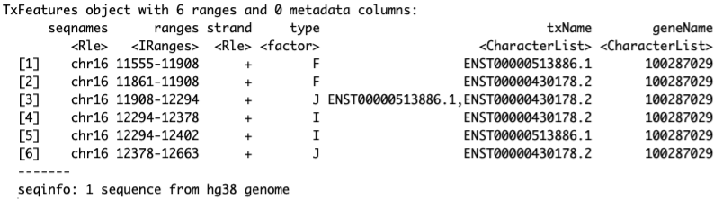

*convertToTxFeatures()* returns a *TxFeatures* object, which is a *GRanges*-like object with additional columns. - 

- Column *type* indicates the feature type and can take values
  - *J* (splice junction)
  - *I* (internal exon)
  - *F* (first/5′′-terminal exon)
  - *L* (last/5′′-terminal exon)
  - *U* (unspliced transcript)
- *txName*  indicate the transcript
-  *geneName* indicate the gene


#### 2.3.3  The splice graph and the *SGFeatures* class

```R
sgf_ucsc <- convertToSGFeatures(txf_ucsc)
head(sgf_ucsc)
```

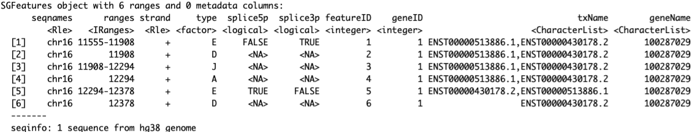

imilar to *TxFeatures*, an *SGFeatures* object is a *GRanges*-like object with additional columns. 

- Column *type* for an *SGFeatures* object takes values
  - *J* (splice junction)
  - *E* (disjoint exon bin)
  - *D* (splice donor site)
  - *A* (splice acceptor site).

- *spliced5p* and *spliced3p* indicate whether exon bins have a mandatory splice at the 5′′ and 3′′ end

- visualize splicing based on annotations:

  ```R
  plotSpliceGraph(sgf_ucsc, geneID = 1, toscale = "exon")
  ```

  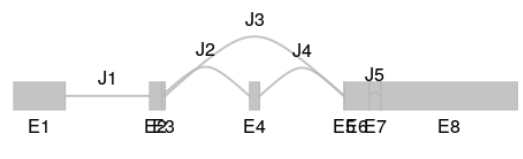

### 2.4  Splice analysis on our data

#### 2.4.1 Splice graph analysis based on annotated transcripts

```R
sgfc_ucsc <- analyzeFeatures(df_full, features = txf_ucsc,cores = 32)
sgfc_ucsc
```

```
class: SGFeatureCounts 
dim: 6 4 
metadata(0):
assays(2): counts FPKM
rownames: NULL
rowData names(0):
colnames(4): Control_rep1 Control_rep2 Rad21KD_rep1 Rad21KD_rep2
colData names(6): sample_name file_bam ... frag_length lib_size
```

- *analyzeFeatures()* returns an *SGFeatureCounts* object. 

```
colData(sgfc_ucsc)  ##sample information as colData
rowRanges(sgfc_ucsc) ##splice graph features as rowRanges
head(counts(sgfc_ucsc)) ##counts store compatible fragment counts
head(FPKM(sgfc_ucsc)) ##FPKM store compatible FPKMs
```

> Counts for exons and splice junctions are based on structurally compatible fragments. **In the case of splice donors and acceptors**, counts indicate the number of fragments with **reads spanning the spliced boundary** (overlapping the splice site and the flanking intronic position).

> FPKM values are calculated as $(x/NL)*10^6$, where $x$ is the number of compatible fragments, $N$ is the library size (stored in *lib_size*) and *L* is the effective feature length (the number of possible positions for a compatible fragment).

- FPKMs for splice graph features can be visualized with function *plotFeatures*.

```R
plotFeatures(sgfc_ucsc, geneID = 1,include = "junction",toscale="exon")
```

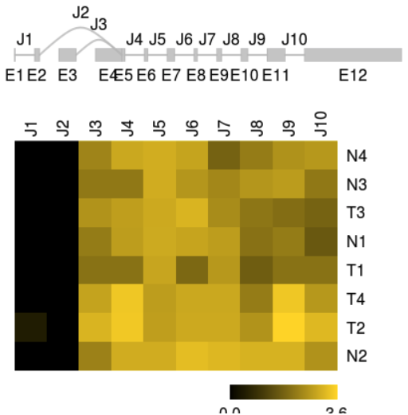

#### 2.4.2 Splice analysis based on *de novo* prediction

Instead of relying on existing annotation, 

- annotation can be augmented with predictions from RNA-seq data.
- the splice graph can be constructed from RNA-seq data without the use of annotation. 

```
sgfc_pred <- analyzeFeatures(df_complete,cores=30)
head(rowRanges(sgfc_pred))
```

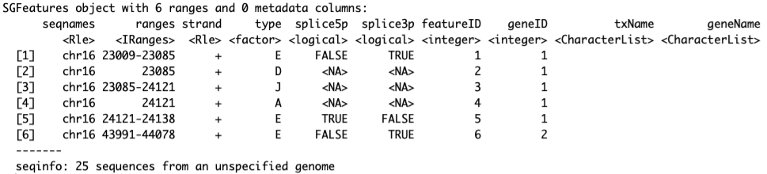

For interpretation, predicted features can be annotated with respect to known transcripts. 

- The *annotate()* function assigns compatible transcripts to each feature and stores the corresponding transcript and gene name in columns *txName* and *geneName*, respectively.

```
sgfc_pred <- annotate(sgfc_pred, txf_ucsc)
head(rowRanges(sgfc_pred))
```

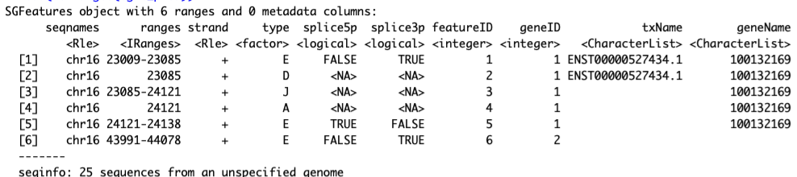

- The predicted splice graph and FPKMs can be visualized as previously.

```R
 plotFeatures(sgfc_pred, geneID =22, color_novel = "red",toscale="none",include="both")
```

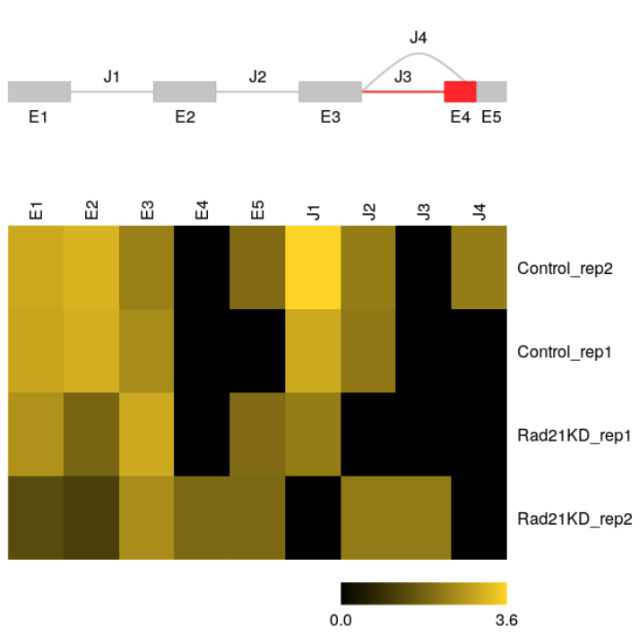

- A example from SGSeq tutorial

  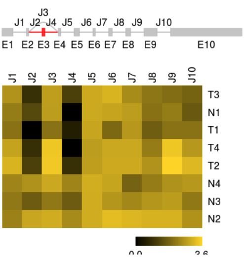

  - most exons and splice junctions predicted from RNA-seq data are consistent with transcripts in the UCSC knownGene table (shown in grey)
  -  unannotated exon (shown in red) was discovered from the RNA-seq data
  -  predicted gene model does not include parts of the splice graph that are not expressed in the data


### 2.5.  Splice variant identification

Instead of considering the complete splice graph of a gene, the analysis can be focused on individual splice events. 

```R
sgvc_pred <- analyzeVariants(sgfc_pred,cores=30)
sgvc_pred
```

```
class: SGVariantCounts 
dim: 13504 4 
metadata(0):
assays(5): countsVariant5p countsVariant3p countsEvent5p countsEvent3p variantFreq
rownames: NULL
rowData names(20): from to ... variantType variantName
colnames(4): Control_rep1 Control_rep2 Rad21KD_rep1 Rad21KD_rep2
colData names(6): sample_name file_bam ... frag_length lib_size
```

*analyzeVariants()* returns an *SGVariantCounts* object. 

```R
colData(sgvc_pred) ##Sample information is stored as colData
rowRanges(sgvc_pred) ##splice graph features as rowRanges
mcols(sgvc_pred) ##Information on splice variants
```

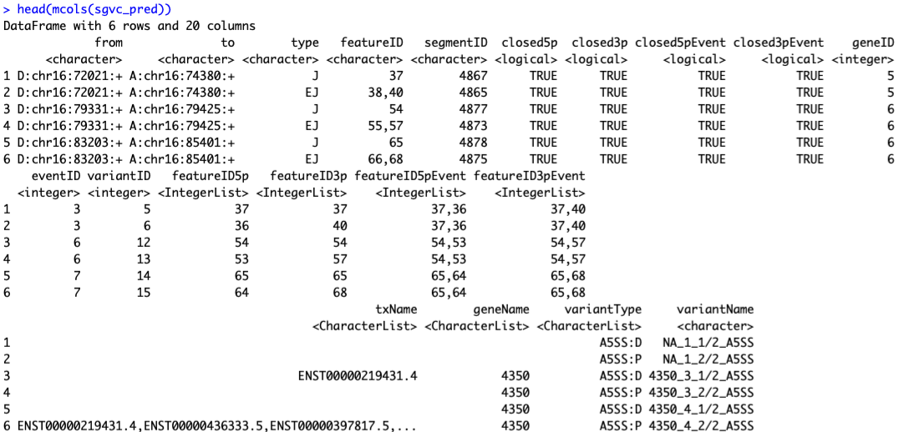


### 2.6 Splice variant quantification

> Splice variants are quantified locally, based on structurally compatible fragments that overlap the start or end of each variant. Local estimates of relative usage ψiψi for variant ii are obtained as the number of fragments compatible with ii divided by the number of fragments compatible with any variant belonging to the same event. For variant start SS and variant end EE ψSi=xSi/xS.ψiS=xiS/x.S and ψEi=xEi/xE.ψiE=xiE/x.E, respectively. For variants with valid estimates ψSiψiS and ψEiψiE a single estimate is calculated as a weighted mean of local estimates ψi=xS./(xS.+xE.)ψSi+xE./(xS.+xE.)ψEiψi=x.S/(x.S+x.E)ψiS+x.E/(x.S+x.E)ψiE.**Estimates of relative usage can be unreliable for events with low read count**. If argument *min_denominator* is specified for functions *analyzeVariants()* or *getSGVariantCounts()*, estimates are set to *NA* unless at least one of xS.x.S or xE.x.E is equal or greater to the specified value.

- Estimates (0~1) of relative usage:

```R
variantFreq(sgvc_pred)
```

```
> head(variantFreq(sgvc_pred))
     Control_rep1 Control_rep2 Rad21KD_rep1 Rad21KD_rep2
[1,]            0   0.21052632            0         0.20
[2,]            1   0.78947368            1         0.80
[3,]            0   0.80000000            0         0.40
[4,]            1   0.20000000            1         0.60
[5,]            0   0.01587302            0         0.02
[6,]            1   0.98412698            1         0.98
```

**!! Independent of raw counts or gene expression levels**

- Splice variants and estimates of relative usage are visualized with function *plotVariants*.

```R
plotVariants(sgvc_pred, eventID = 6, color_novel = "red",margin=0.4)
```

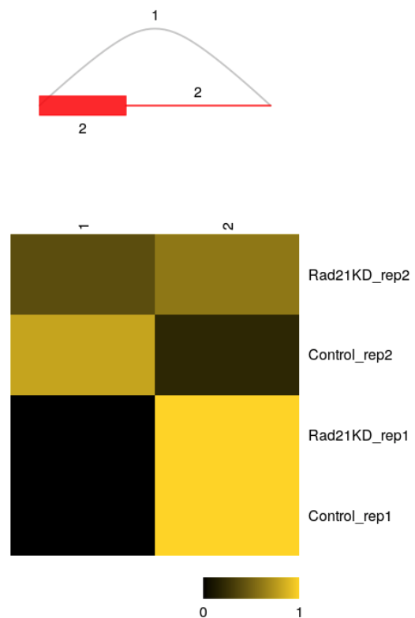

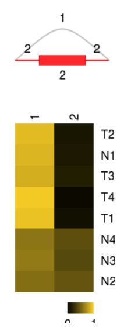

- Raw counts data of each variants:

```
sgv <- rowRanges(sgvc_pred)
sgvc <- getSGVariantCounts(sgv, sample_info = df_full)
x <- counts(sgvc)
```

```
> head(x)
         Control_rep1 Control_rep2 Rad21KD_rep1 Rad21KD_rep2
    [1,]            0            2            0            1
    [2,]           14           15            8            8
    [3,]            0            2            0            1
    [4,]            1            1            2            2
    [5,]            0            1            0            1
    [6,]           98          114           88           84
```

- perbase read coverages and splice junction counts can be visualized with function *plotCoverage*.

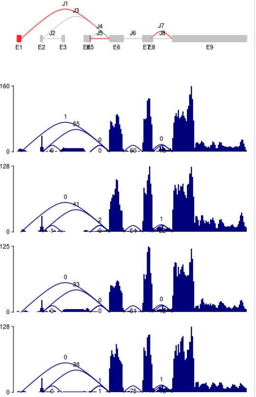


### 2.7 differential splice variant 

> *SGSeq* does not implement statistical tests for differential splice variant usage. However, existing software packages such as *[DEXSeq](http://bioconductor.org/packages/DEXSeq)*(Anders, Reyes, and Huber 2012) and *[limma](http://bioconductor.org/packages/limma)* (Ritchie et al. 2015) can be used for this purpose.

Here I tried DEXSeq (Require replicates!!)

```R
BiocManager::install("DEXSeq")
library("DEXSeq")

x <- counts(sgvc)
vid <- as.character(variantID(sgvc))
eid <- as.character(eventID(sgvc))
sampleTable <- data.frame(row.names=c(paste("control", 1:2, sep=""), paste("cohesinKD", 1:2, sep="")), condition=rep(c("control","knockdown"), c(2, 2)))
design= ~sample+exon+condition:exon

dxd =  DEXSeqDataSet(countData = x, featureID = vid, 
                     groupID = eid, sampleData = sampleTable,
                     design= design)

ncpu = MulticoreParam(20)
dxr <- DEXSeq(dxd,BPPARAM=ncpu)
plotMA(dxr)
```

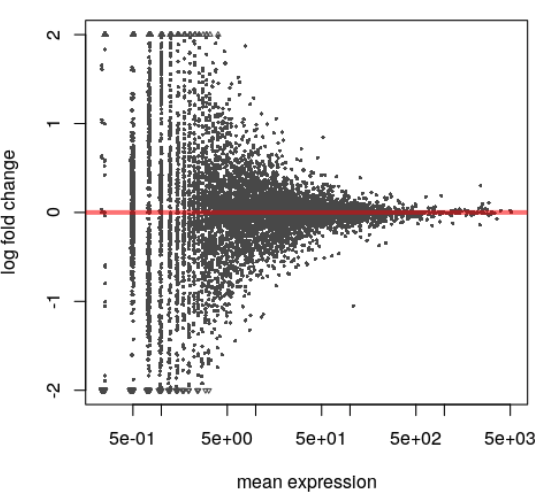

### 2.8. Bugs

The SGSeq software did not compatiable for "alt" chromosome, so if use all chromosome:

```R
library(TxDb.Hsapiens.UCSC.hg38.knownGene)
txdb <- TxDb.Hsapiens.UCSC.hg38.knownGene
seqlevels(txdb)

txf_ucsc <- convertToTxFeatures(txdb)
sgfc_ucsc <- analyzeFeatures(df_complete, features = txf_ucsc,cores = 32)
```

In these case, the chromosome include:

```
> seqlevels(txdb)
  [1] "chr1"                    "chr2"                    "chr3"                   
  [4] "chr4"                    "chr5"                    "chr6"                   
  [7] "chr7"                    "chr8"                    "chr9"                   
 [10] "chr10"                   "chr11"                   "chr12"                  
 [13] "chr13"                   "chr14"                   "chr15"                  
 [16] "chr16"                   "chr17"                   "chr18"                  
 [19] "chr19"                   "chr20"                   "chr21"                  
 [22] "chr22"                   "chrX"                    "chrY"                   
 [25] "chrM"                    "chr1_GL383518v1_alt"     "chr1_GL383519v1_alt"    
 [28] "chr1_GL383520v2_alt"     "chr1_KI270706v1_random"  "chr1_KI270707v1_random" 
 [31] "chr1_KI270708v1_random"  "chr1_KI270709v1_random"  "chr1_KI270710v1_random" 
 [34] "chr1_KI270711v1_random"  "chr1_KI270712v1_random"  "chr1_KI270713v1_random" 
 [37] "chr1_KI270714v1_random"  "chr1_KI270759v1_alt"     "chr1_KI270760v1_alt"    
 [40] "chr1_KI270761v1_alt"     "chr1_KI270762v1_alt"     "chr1_KI270763v1_alt"    
 [43] "chr1_KI270764v1_alt"     "chr1_KI270765v1_alt"     "chr1_KI270766v1_alt"    
 [46] "chr1_KI270892v1_alt"     "chr1_KN196472v1_fix"     "chr1_KN196473v1_fix"    
 [49] "chr1_KN196474v1_fix"     "chr1_KN538360v1_fix"     "chr1_KN538361v1_fix"    
 [52] "chr1_KQ031383v1_fix"     "chr1_KQ458382v1_alt"     "chr1_KQ458383v1_alt"    
 [55] "chr1_KQ458384v1_alt"     "chr1_KQ983255v1_alt"     "chr1_KV880763v1_alt"    
 [58] "chr1_KZ208904v1_alt"     "chr1_KZ208905v1_alt"     "chr1_KZ208906v1_fix"    
 [61] "chr1_KZ559100v1_fix"     "chr2_GL383521v1_alt"     "chr2_GL383522v1_alt"    
```

The error will occured like:

```
Process features...
Obtain counts...
 validObject(.Object) でエラー: 
  invalid class “RangedSummarizedExperiment” object: 
    'x@assays' is not parallel to 'x'
 追加情報:  警告メッセージ: 
1:  valid.GenomicRanges.seqinfo(x, suggest.trim = TRUE) で: 
  GRanges object contains 11 out-of-bound ranges located on sequences chr5_KI270898v1_alt,
  chr6_KI270798v1_alt, chr12_GL383551v1_alt, chr12_GL383553v2_alt, chr12_KI270834v1_alt,
  chr17_KV766198v1_alt, chr19_GL383575v2_alt, chr19_KI270890v1_alt, chr19_KI270932v1_alt,
```

So, we only focus on main chromosomes by: 

```R
> txdb <- keepSeqlevels(txdb,paste0("chr",c(1:22,"X","Y","M")))
> seqlevels(txdb)
 [1] "chr1"  "chr2"  "chr3"  "chr4"  "chr5"  "chr6"  "chr7"  "chr8"  "chr9"  "chr10" "chr11" "chr12" "chr13"
[14] "chr14" "chr15" "chr16" "chr17" "chr18" "chr19" "chr20" "chr21" "chr22" "chrX"  "chrY"  "chrM" 
```

Then, we can run the analyzeFeatures:

```R
txf_ucsc <- convertToTxFeatures(txdb)
sgfc_pred <- analyzeFeatures(df_complete,cores=42)
sgfc_pred <- annotate(sgfc_pred, txf_ucsc)
```


## 3.MISO


> MISO (Mixture-of-Isoforms) is a probabilistic framework that quantitates the expression level of alternatively spliced genes from RNA-Seq data, and identifies differentially regulated isoforms or exons across samples

> The MISO framework is described in Katz et. al., [Analysis and design of RNA sequencing experiments for identifying isoform regulation](http://www.nature.com/nmeth/journal/v7/n12/full/nmeth.1528.html). *Nature Methods* (2010).

> MISO treats the expression level of a set of isoforms as a random variable and estimates a distribution over the values of this variable.

Overview:


## 3.1 Preparation

#### 3.1.1 Installation

- Miso requires **Python2** !!

```shell
conda create -n py27 python=2.7
conda env list
conda activate py27
```

- Install vis pypi

```
pip install misopy
```


#### 3.1.2 Annotation

 Two general kinds of analyses are possible:

1. Estimate expression level of exons (**“exon-centric” analysis**). Exon-centric analyses are recommended for looking at **alternative splicing** at the level of individual splicing events
2. Estimate expression level of whole transcripts (**“isoform-centric” analysis**). In isoform-centric analyses the expression level of whole isoforms for genes are estimated

The annotation can be in the [GFF](http://www.sequenceontology.org/gff3.shtml) format:

- which specify single alternative splicing events (**“exon-centric”**):

  - Skipped exons (SE)
  - Alternative 3’/5’ splice sites (A3SS, A5SS)
  - Mutually exclusive exons (MXE)
  - Retained introns (RI)
  - Tandem 3’ UTRs (TandemUTR)
  - Alternative first exons (AFE)
  - Alternative last exons (ALE)

  ```
  chr1  SE      gene    4772649 4775821 .       -       .       ID=chr1:4775654:4775821:-@chr1:4774032:4774186:-@chr1:4772649:4772814:-;Name=chr1:4775654:4775821:-@chr1:4774032:4774186:-@chr1:4772649:4772814:-
  chr1  SE      mRNA    4772649 4775821 .       -       .       ID=chr1:4775654:4775821:-@chr1:4774032:4774186:-@chr1:4772649:4772814:-.A;Parent=chr1:4775654:4775821:-@chr1:4774032:4774186:-@chr1:4772649:4772814:-
  chr1  SE      mRNA    4772649 4775821 .       -       .       ID=chr1:4775654:4775821:-@chr1:4774032:4774186:-@chr1:4772649:4772814:-.B;Parent=chr1:4775654:4775821:-@chr1:4774032:4774186:-@chr1:4772649:4772814:-
  chr1  SE      exon    4775654 4775821 .       -       .       ID=chr1:4775654:4775821:-@chr1:4774032:4774186:-@chr1:4772649:4772814:-.A.up;Parent=chr1:4775654:4775821:-@chr1:4774032:4774186:-@chr1:4772649:4772814:-.A
  chr1  SE      exon    4774032 4774186 .       -       .       ID=chr1:4775654:4775821:-@chr1:4774032:4774186:-@chr1:4772649:4772814:-.A.se;Parent=chr1:4775654:4775821:-@chr1:4774032:4774186:-@chr1:4772649:4772814:-.A
  chr1  SE      exon    4772649 4772814 .       -       .       ID=chr1:4775654:4775821:-@chr1:4774032:4774186:-@chr1:4772649:4772814:-.A.dn;Parent=chr1:4775654:4775821:-@chr1:4774032:4774186:-@chr1:4772649:4772814:-.A
  chr1  SE      exon    4775654 4775821 .       -       .       ID=chr1:4775654:4775821:-@chr1:4774032:4774186:-@chr1:4772649:4772814:-.B.up;Parent=chr1:4775654:4775821:-@chr1:4774032:4774186:-@chr1:4772649:4772814:-.B
  chr1  SE      exon    4772649 4772814 .       -       .       ID=chr1:4775654:4775821:-@chr1:4774032:4774186:-@chr1:4772649:4772814:-.B.dn;Parent=chr1:4775654:4775821:-@chr1:4774032:4774186:-@chr1:4772649:4772814:-.B
  ```

  How to prepare it is introduced in a bolg (http://imamachi-n.hatenablog.com/entry/2017/03/28/234104)

  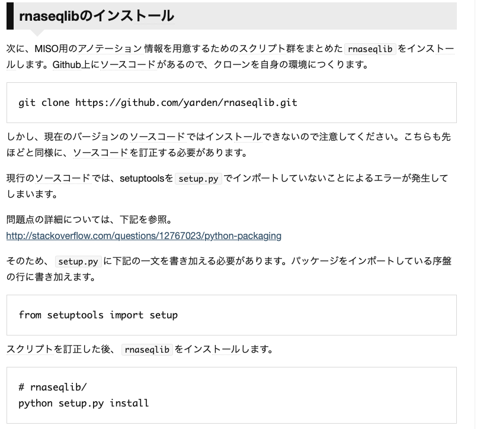

  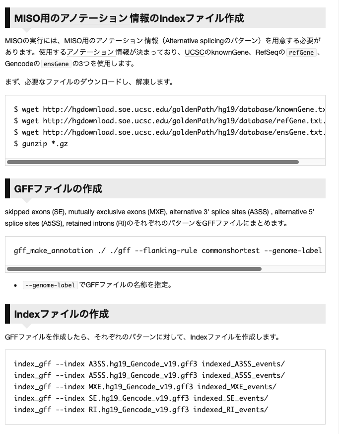

```
$ ls hg38_SEindex 
indexed_A3SS_events
indexed_A5SS_events
indexed_MXE_events
indexed_RI_events
indexed_SE_events
```


- Any gene models annotation can be used (e.g. from Ensembl, UCSC or RefSeq) as long as it is specified in the GFF3 format.  (**“isoform-centric” **)
  - To estimate the expression level of whole mRNA transcripts, a GFF format containing a set of annotated transcripts for each gene can be used


#### 3.1.3 What is Ψ values (“Percent Spliced In”. Katz et. al. 2010)

> The exon-inclusion ratio, also known as percent spliced in (PSI), is a popular statistic for measuring alternative splicing events

> It is defined as the ratio of the relative abundance of all isoforms containing a certain exon over the relative abundance of all isoforms of the gene containing the exon.

**Ψ = PSI = splice_in / (splice_in +splice_out)。**

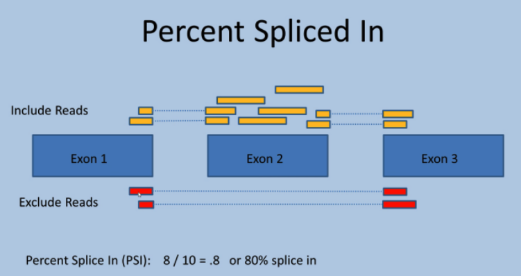

- **Advantages**: PSI exclusively captures a specific type of event, simple exon skipping. It also doesn’t have to rely on known transcript annotations, so can capture exon skipping events that wouldn’t be captured using other methods like the transcript ratio method.
- **Disadvantages**: same as the advantage: it only captures exon skipping events. It wouldn’t be good at picking up switching between two totally different isoforms, alternative 3’ or 5’ ends of exons, etc. Since these complex events seem to be quite abundant, PSI will miss a lot of splice variation events.

### 3.2 Run Miso

``` shell
for bam in `ls ~/testbam/*bam`
do
       type=SE
       prefix=`basename $bam .bam`
	     echo $prefix
	     miso --run ./hg38_SEindex $bam --output-dir misoout/${prefix}_$type -p 64 --read-len 66 #run each sample for indicated splicing types
       summarize_miso --summarize-samples misoout/$prefix.$type misomerge/$prefix.$type # merger results
done
```

```
$ ls misoout/Control_rep1_SE/
batch-genes  chr11  chr15  chr19  chr22  chr6  chrX             scripts_output
batch-logs   chr12  chr16  chr2   chr3   chr7  chrY
chr1         chr13  chr17  chr20  chr4   chr8  cluster_scripts
chr10        chr14  chr18  chr21  chr5   chr9  logs

$ ls misomerge/Control_rep1_SE/summary/
Control_rep1_SE.miso_summary
```


### 3.3 Compare samples

- Compare

```shell
compare_miso --compare-samples misoout/Rad21KD_rep1_SE misoout/Contorl_rep1_SE misoCompare
```

```
$ tree misoCompare
misoCompare
└── Rad21KD_rep1_SE_vs_Control_rep1_SE
    └── bayes-factors
        └── Rad21KD_rep1_SE_vs_Control_rep1_SE.miso_bf
        
$ wc -l misoCompare/Rad21KD_rep1_SE_vs_Control_rep1_SE/bayes-factors/Rad21KD_rep1_SE_vs_Control_rep1_SE.miso_bf
4380 
```

- Filter

```shell
bf=/home/wang/testmiso/misoCompare/Rad21KD_rep1_SE_vs_Control_rep1_SE/bayes-factors/Rad21KD_rep1_SE_vs_Control_rep1_SE.miso_bf

filter_events --filter $bf \
      --num-inc 1 \
      --num-exc 1 \
      --num-sum-inc-exc 10 \
      --delta-psi 0.20 \
      --bayes-factor 10 \
      --output-dir ./filter_out
```

```
$ ls filter_out/
Rad21KD_rep1_SE_vs_Control_rep1_SE.miso_bf.filtered

$ wc -l Rad21KD_rep1_SE_vs_Control_rep1_SE.miso_bf.filtered
16
```


details: https://miso.readthedocs.io/en/fastmiso/#detecting-differentially-expressed-isoforms

### 3.4 Visualization


- prepare `sashimi_plot_settings.txt`:

  ``` 
  [data]
  # directory where BAM files are
  bam_prefix = ~/CHX_sakata/testbam/
  # directory where MISO output is
  miso_prefix = ./misoout/
  
  bam_files = [
            "Control_rep1.bam",
            "Control_rep2.bam",
            "Rad21KD_rep1.bam",
            "Rad21KD_rep2.bam"]
  
  miso_files = [
             "Control_rep1.SE",
             "Control_rep2.SE",
             "Rad21KD_rep1.SE",
             "Rad21KD_rep2.SE"]
  
  [plotting]
  # Dimensions of figure to be plotted (in inches)
  fig_width = 7
  fig_height = 5
  # Factor to scale down introns and exons by
  intron_scale = 30
  exon_scale = 4
  # Whether to use a log scale or not when plotting
  logged = False
  font_size = 6
  
  # Max y-axis
  ymax = 50
  
  # Whether to plot posterior distributions inferred by MISO
  show_posteriors = True
  
  # Whether to show posterior distributions as bar summaries
  bar_posteriors = False
  
  # Whether to plot the number of reads in each junction
  number_junctions = True
  
  resolution = .5
  posterior_bins = 40
  gene_posterior_ratio = 5
  
  # List of colors for read denisites of each sample
  colors = [
      "#CC0011",
      "#CC0011",
      "#FF8800",
      "#FF8800"]
  
  # Number of mapped reads in each sample
  # (Used to normalize the read density for RPKM calculation)
  coverages = [
      36895920,
      34846039,
      35664259,
      36249469]
  
  # Bar color for Bayes factor distribution
  # plots (--plot-bf-dist)
  # Paint them blue
  bar_color = "b"
  
  # Bayes factors thresholds to use for --plot-bf-dist
  bf_thresholds = [0, 1, 2, 5, 10, 20]
  ```

- plot

```shell
for event in `cat filter_out/Rad21KD_rep1_SE_vs_Control_rep1_SE.miso_bf.filtered | cut -f1`
do
        sashimi_plot --plot-event "$event" ./hg38_SEindex \
                sashimi_plot_settings.txt --output-dir plot/
done
```

- check results:

```
$ ls plot/
chr16:14644274:14644609:+@chr16:14649804:14649973:+@chr16:14655066:14655210:+.pdf
chr16:16333647:16333884:+@chr16:16336052:16336137:+@chr16:16340306:16340434:+.pdf
chr16:3283491:3284205:+@chr16:3288454:3288570:+@chr16:3289393:3291460:+.pdf
chr16:47109483:47109711:-@chr16:47086226:47086339:-@chr16:47077703:47083801:-.pdf
chr16:5097644:5097820:-@chr16:5097280:5097353:-@chr16:5095452:5095514:-.pdf
chr16:68232577:68232687:-@chr16:68232371:68232503:-@chr16:68232246:68232288:-.pdf
chr16:68533698:68533855:+@chr16:68539758:68539825:+@chr16:68557998:68558124:+.pdf
chr17:42017340:42017439:-@chr17:42003359:42003557:-@chr17:42000482:42000570:-.pdf
chr17:75978534:75978693:-@chr17:75973625:75973785:-@chr17:75957459:75957566:-.pdf
chr17:76091143:76091235:-@chr17:76090329:76090397:-@chr17:76089175:76089320:-.pdf
chr17:76094414:76094581:-@chr17:76090329:76090397:-@chr17:76089175:76089320:-.pdf
chr17:7907353:7907488:+@chr17:7907601:7907702:+@chr17:7907894:7908019:+.pdf
chr17:80415650:80415821:+@chr17:80417781:80417945:+@chr17:80423520:80423632:+.pdf
chr17:81445354:81445681:+@chr17:81446738:81446830:+@chr17:81447036:81447848:+.pdf
chr17:8460009:8460160:+@chr17:8463320:8463354:+@chr17:8466930:8468163:+.pdf
```

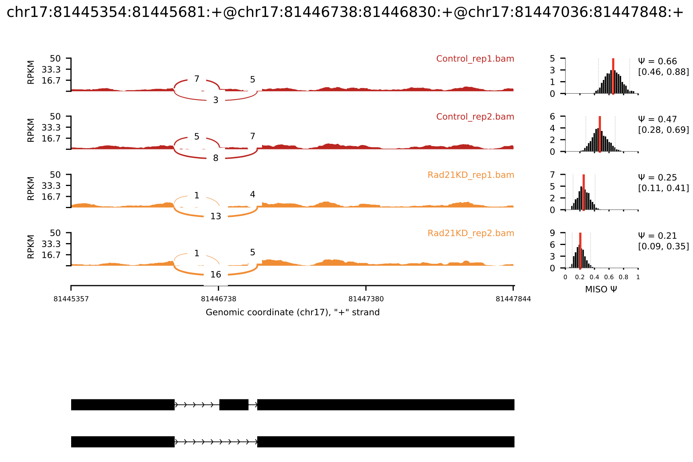


## 4. Compare of MISO and DEXseq

http://imamachi-n.hatenablog.com/entry/2017/03/28/234104

###### MISO

- 最も引用数が多く、精度も高い（個人的な意見です）。[Alternative](http://d.hatena.ne.jp/keyword/Alternative) splicingの解析では、[デファクトスタンダード](http://d.hatena.ne.jp/keyword/%A5%C7%A5%D5%A5%A1%A5%AF%A5%C8%A5%B9%A5%BF%A5%F3%A5%C0%A1%BC%A5%C9)のソフト。
- skipped exons (SE), mutually exclusive exons (MXE), [alternative](http://d.hatena.ne.jp/keyword/alternative) 3' splice sites (A3SS) , [alternative](http://d.hatena.ne.jp/keyword/alternative) 5' splice sites (A5SS), retained introns (RI)のパターンごとに解析してくれる。
- n=1のデータしか扱えない（n=2同士のデータを比較することができない）。
- 扱える[アノテーション](http://d.hatena.ne.jp/keyword/%A5%A2%A5%CE%A5%C6%A1%BC%A5%B7%A5%E7%A5%F3)情報が限定されている（[UCSC](http://d.hatena.ne.jp/keyword/UCSC) gene, RefSeq, Gencodeの組み合わせ。[UCSC](http://d.hatena.ne.jp/keyword/UCSC)genome browserにアップロードされている最新のデータにしか対応していない）。
- 結果ファイルの中身がSplicingのイベントごとに評価されているため、どの遺伝子でSplicingのパターンの変化が起こっているかわかりにくい。
- p-valueによる有意差検定でなく、Bayes factorを計算しているので、どこでThresholdを引いたらいいかわかりにくい。

###### DEXSeq

- MISOについで有名なソフト。精度自体はイマイチなイメージ（個人的な意見です）。
- Duplicatesに対応しているので、n>=2のデータ同士の比較が可能（内部的にはDESeqの[アルゴリズム](http://d.hatena.ne.jp/keyword/%A5%A2%A5%EB%A5%B4%A5%EA%A5%BA%A5%E0)で２群間比較している）。
- [アノテーション](http://d.hatena.ne.jp/keyword/%A5%A2%A5%CE%A5%C6%A1%BC%A5%B7%A5%E7%A5%F3)情報は自由に選択できる。
- 遺伝子のIDとTranscriptのIDがタグ付けされているのでリストが見やすい。
- Exonブロックごとに評価する（この方法がイマイチな印象）ので、SE, MXE, A3SS, A5SS, RIのどのパターンの変化か判別しづらい。

