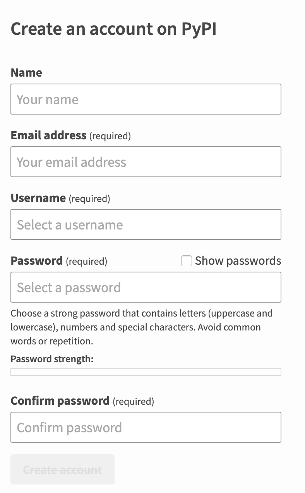
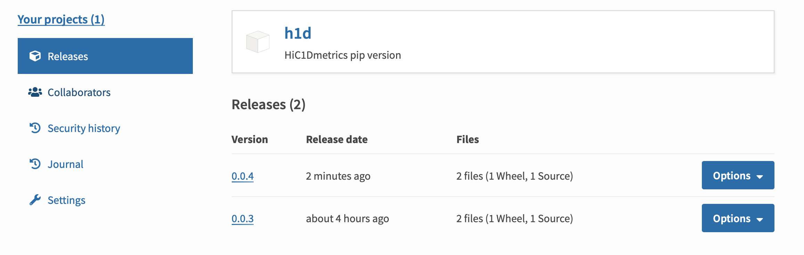

# Upload the python package to pypi

## 1. Prepare a `__init__.py` and `__main__.py` file for your package.

```shell
├── h1d
│   ├── AsymmetricTad.py
│   ├── HiCmetric.py
│   ├── MultiTypeScore.py
│   ├── Multi_samples_metrics.py
│   ├── __init__.py
│   ├── __main__.py
```

> `__init__.py` is required to import the directory as a package, and can simply be an empty file.

For example, I prepared the `__init__.py`  file as:

```python
# -*- coding: utf-8 -*-
print("nothing")

def hello():
    print("hello world")
```

> `'__main__'` is the name of the scope in which top-level code executes. A module’s __name__ is set equal to `'__main__'` when read from standard input, a script, or from an interactive prompt.
>
> ```python
> if __name__ == "__main__":
>     # execute only if run as a script
>     main()
> ```
>
> For a package, the same effect can be achieved by including a `__main__.py` module, the contents of which will be executed when the module is run with `-m`.

Simply speaking,  `__main__.py`  will be automatically run, when we use the whole module (here is `h1d` directory).

I prepared the `__main__.py`  file as:

```python
import argparse

def main():
    parser = argparse.ArgumentParser()
    parser.add_argument("type",help="type anything",type=str)
    args = parser.parse_args()
    print(args.type)

if __name__=='__main__':
    main()
```


Now our folder `h1d` is a module. We can test our module via command line:

```shell
python -m h1d 1234abcd
```

This command will use `h1d`>>`__init__.py`>>`__main__.py`, so the output will be:

```shell
nothing
1234abcd
```

Please note we can also run 

```
python h1d 1234abcd
```

In this case,  the script will run as the `__main__.py`module instead of the `h1d` module

So the output will be

```
1234abcd
```

## 2.prepare the file `setup.py`

Create the new files listed below:

```shell
├── LISENSE
├── README.md
├── h1d
│   ├── AsymmetricTad.py
│   ├── HiCmetric.py
│   ├── MultiTypeScore.py
│   ├── Multi_samples_metrics.py
│   ├── __init__.py
│   ├── __main__.py
│   ├── __pycache__
│   ├── calcuDiffCI.py
│   ├── calculateMetrics.py
│   ├── calculateTwoSample.py
│   ├── callDirectionalTAD.py
│   ├── calldTADAllchr.py
│   ├── discrete.py
│   ├── geneDensity
│   ├── loadfile.py
│   ├── plotMetrics.py
│   ├── plotTwoSample.py
│   └── test.py
└── setup.py
```

- `README.md` is used to store long description.
- `LISENCE` tells users who install your package the terms under which they can use your package. Choose a license according to <https://choosealicense.com/>

> `setup.py` is the build script for [setuptools](https://packaging.python.org/key_projects/#setuptools). It tells setuptools about your package (such as the name and version) as well as which code files to include.

```python
from setuptools import setup

with open("README.md", "r", encoding="utf-8") as fh:
    readme = fh.read()

setup(
    name='h1d',  #distribution name of your package 
    version='0.0.4',   #package version
    author='wangjiankng', 
    author_email='wangjk321@gmail.com',
    url='https://github.com/wangjk321/HiC1Dmetrics',
    description='HiC1Dmetrics pip version',   #short description
    long_description=readme,     #detailed description of the package
    long_description_content_type="text/markdown",  #what type of markup is used
    packages=['h1d'],     #a list of all packages that should be included 
    install_requires=["pandas","numpy","scikit-learn"],  #specify dependencies
    classifiers=[    #gives index and pip  additional metadata about your package
        "Programming Language :: Python :: 3", #only compatible with Python 3
        "License :: OSI Approved :: GNU General Public License v3 (GPLv3)",
        "Operating System :: OS Independent",
    ],
    entry_points={
        'console_scripts': [
            'h1dtest=h1d:hello',
            'h1d=h1d.__main__:main',
        ]}
)
```

> Use “console_script” [entry points](https://setuptools.readthedocs.io/en/latest/setuptools.html#dynamic-discovery-of-services-and-plugins) to register your script interfaces.

This entry_ponits means we can directly use `h1dtest` and `h1d` in **command-line interface** (**CLI** ).  

- `h1dtest`  will use the `hello` function defined in `__init__.py` 

- `h1d` will use the `main` function defined in `__main__.py`

  

## 3. Generating distribution archives

Make sure you have the latest versions of `setuptools` , `twine`and `wheel` installed

```python
pip install --user --upgrade setuptools wheel twine
```

Run the following command from the same directory where `setup.py` is located:

```python
python3 setup.py sdist bdist_wheel
```

This command should generate two files in the `dist`directory:

```
dist
├── h1d-0.0.4-py3-none-any.whl
└── h1d-0.0.4.tar.gz
```

- The `tar.gz` file is a [Source Archive](https://packaging.python.org/glossary/#term-Source-Archive) 
- The `.whl` file is a [Built Distribution](https://packaging.python.org/glossary/#term-Built-Distribution). 
- Newer [pip](https://packaging.python.org/key_projects/#pip) versions preferentially install built distributions, but will fall back to source archives if needed.

## 4. Register an account on PyPI

https://pypi.org/account/register/



## 5. Uploading the distribution archives

```python
python3 -m twine upload --repository-url https://upload.pypi.org/legacy/ dist/*
## if exsiting error, add ""--skip-existing"
```

The output will be:

```shell
Uploading distributions to https://upload.pypi.org/legacy/
Enter your username: XXXXXX
Enter your password: XXXXXX
Uploading h1d-0.0.4-py3-none-any.whl
100%|██████████████████████████████████████████████████████████████████████████████████| 37.0k/37.0k [00:02<00:00, 18.0kB/s]
Uploading h1d-0.0.4.tar.gz
100%|██████████████████████████████████████████████████████████████████████████████████| 32.2k/32.2k [00:01<00:00, 21.5kB/s]

View at:
https://pypi.org/project/h1d/0.0.4/
```



## 6. Try the new package

In other PC, try:

```shell
pip install h1d
```

The output:

```shell
Collecting h1d
  Downloading h1d-0.0.4-py3-none-any.whl (26 kB)
Requirement already satisfied: pandas in ./software/anaconda3/lib/python3.6/site-packages (from h1d) (1.1.5)
Requirement already satisfied: numpy in ./software/anaconda3/lib/python3.6/site-packages (from h1d) (1.19.2)
Requirement already satisfied: scikit-learn in ./software/anaconda3/lib/python3.6/site-packages (from h1d) (0.22.2.post1)
Requirement already satisfied: python-dateutil>=2.7.3 in ./software/anaconda3/lib/python3.6/site-packages (from pandas->h1d) (2.8.1)
Requirement already satisfied: pytz>=2017.2 in ./software/anaconda3/lib/python3.6/site-packages (from pandas->h1d) (2020.4)
Requirement already satisfied: six>=1.5 in ./software/anaconda3/lib/python3.6/site-packages (from python-dateutil>=2.7.3->pandas->h1d) (1.15.0)
Requirement already satisfied: scipy>=0.17.0 in ./software/anaconda3/lib/python3.6/site-packages (from scikit-learn->h1d) (1.5.2)
Requirement already satisfied: joblib>=0.11 in ./software/anaconda3/lib/python3.6/site-packages (from scikit-learn->h1d) (1.0.0)
Installing collected packages: h1d
Successfully installed h1d-0.0.4
```

Then we can use the new pacakge in python:

```python
>>> import h1d
nothing here
```

Or by command line:

```shell
h1dtest
```

Output:

```
hello world
```

Or by command line:

```shell
h1d 1234abcd
```

Output

```
1234abcd
```


